<p align="center">
  
</p>

# Hi there 👋

I'm a Senior Software Engineer with 7+ years of experience in building scalable, high-performance backend services using C# / .NET ecosystem.

> I don’t just build backend systems — I architect them with purpose.

## 🧑‍💻 About Me

```yaml
name: Ali TajmirRiahi
role: Senior Software Engineer (C# / .NET)
website: alitajmirriahi.is-a.dev
experience: 7+ years
focus: Full Stack, Backend & Scalable Systems

currently_working_on: RESTful APIs & real-time services (SignalR / WebSockets)
core_stack: C# | .NET 6/7/8 | ASP.NET Core | EF Core | SQL Server | Redis
languages: English (C1) | Persian (Native)
open_to_collaborate: Open Source projects
```

- 🏗️ Building **scalable, high-performance systems** with **ASP.NET Core** & **EF Core**
- ⚡ Designing **real-time services** with **SignalR** / **WebSockets**
- 🧱 Architecting with **Clean Architecture (Onion)**, **SOLID** & **Design Patterns**
- 🗄️ Optimizing **SQL Server (T-SQL)** & **PostgreSQL** across 500K+ record datasets
- 🚦 Tuning performance: **async/await**, concurrency, thread safety & memory profiling
- 🔐 Securing APIs with **JWT**, refresh tokens & **RBAC**
- 🧪 Writing tested code with **xUnit** / **NUnit** — unit & integration
- 🤖 Using **AI tools** (Copilot, Cursor, GPT-4o) for reviews, unit tests & live API docs
- 🐳 Shipping with **Docker**, **Swagger** & **CI/CD pipelines**
- 🎓 B.Sc. in Software Engineering — Azad University
- 🌐 Portfolio: [alitajmirriahi.is-a.dev](https://alitajmirriahi.is-a.dev/)
- 💼 LinkedIn: [ali-tajmir-riahi](https://www.linkedin.com/in/ali-tajmir-riahi-532206170)
- 📫 Reach me: [riahi.tajmir@gmail.com](mailto:riahi.tajmir@gmail.com)

## 🛠️ Tech Stack

<h3 align="center">Languages</h3>
<p align="center">
  
  
  
  
</p>

<h3 align="center">Frameworks &amp; Libraries</h3>
<p align="center">
  
  
  
  
  
  
  
</p>

<h3 align="center">Databases &amp; Infrastructure</h3>
<p align="center">
  
  
  
  
  
  
  
</p>

<h3 align="center">Architecture &amp; Practices</h3>
<p align="center">
  
  
  
  
  
  
</p>

<h3 align="center">AI-Assisted Development</h3>
<p align="center">
  
  
  
  
</p>

## 🐍 Contribution Snake

<p align="center">
  
</p>

## 📫 Connect with me

<p align="center">
  <a href="mailto:riahi.tajmir@gmail.com"></a>
  <a href="https://alitajmirriahi.is-a.dev/"></a>
  <a href="https://www.linkedin.com/in/ali-tajmir-riahi-532206170"></a>
</p>
